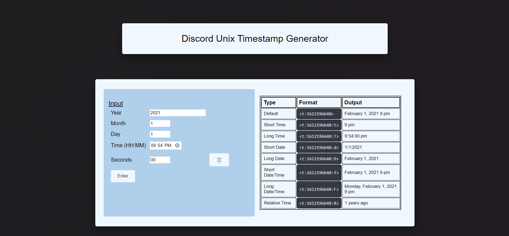

# Discord UNIX timestamp Generator
 A simple tool to produce timestamp for unix messages for [Discord](https://discord.com/) using vanilla JS, HTML and CSS.

Access the link [here](https://mochiron-desu.github.io/discord-unix-timestamp-tool/)

---
## Features
 - It can get the unix format code used on Discord for showing time in 8 formats
	 1. Default Format:  `February 1, 2021 9 pm`
	 2. Short Time: `9 pm`
	 3. Long Time: `9:54:00 pm`
	 4. Short Date: `1/1/2021`
	 5. Long Date: `February 1, 2021`
	 6. Short Date/Time: `February 1, 2021 9 pm`
	 7. Long Date/Time: `Monday, February 1, 2021 9 pm`
	 8. Relative Time: `1 year ago`

## Screenshots

